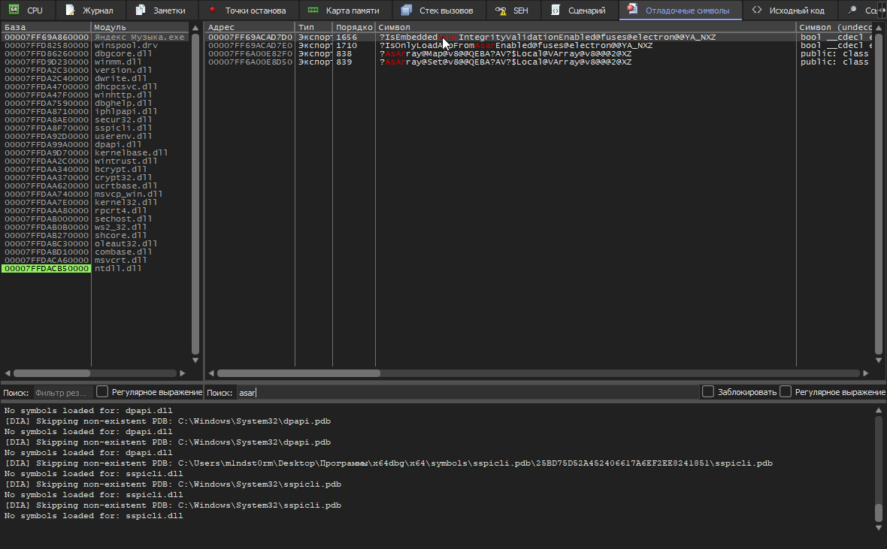
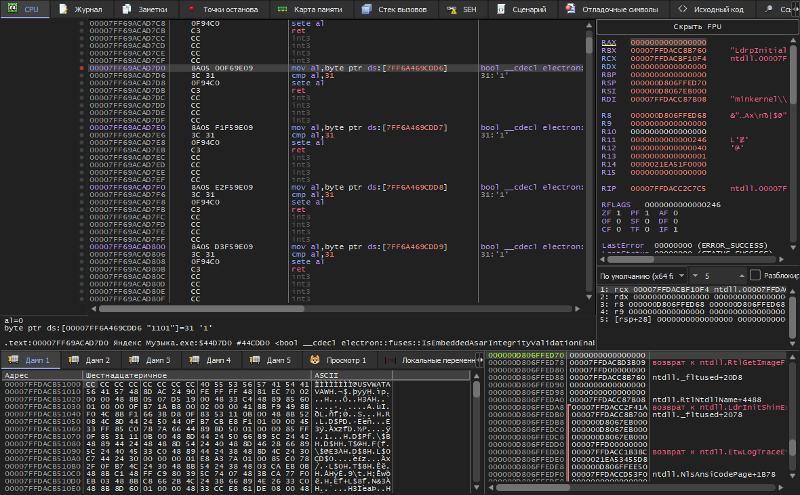
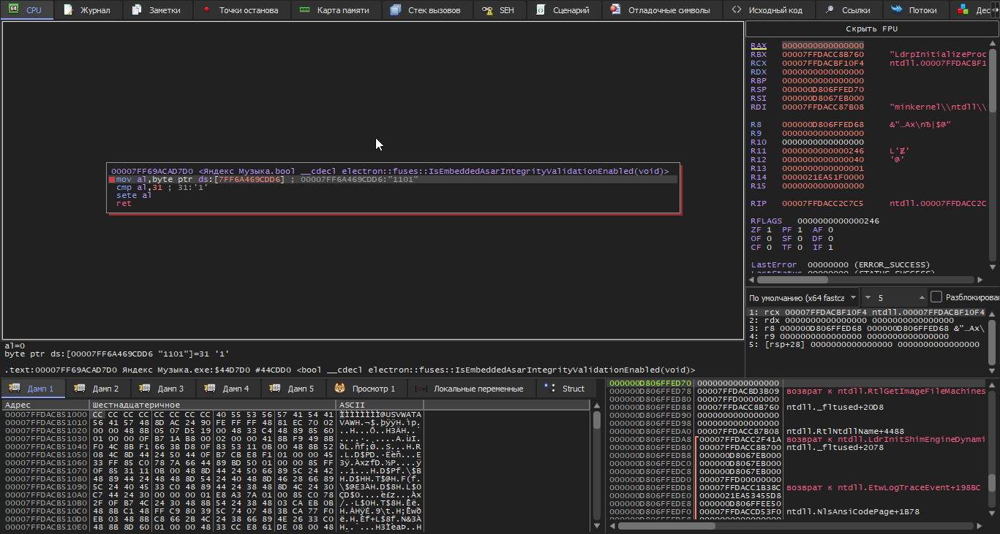

# YaMusic Launcher

В общем немного предисловий о том, что мешает загружаться кастомным .asar файлом в Electron, конечно же вот это:
```
Адрес=00007FF69ACAD7D0
Тип=Экспорт
Порядковый номер=1656
Символ=?IsEmbeddedAsarIntegrityValidationEnabled@fuses@electron@@YA_NXZ
Символ (undecorated)=bool __cdecl electron::fuses::IsEmbeddedAsarIntegrityValidationEnabled(void)
```

Если в кратце, то это встроенная проверка контрольной суммы перед запуском приложения, Яндекс внедрили её для борьбы с модификациями их приложения, но как обычно сделали это через одно место), поэтому ниже прикладываю скрины для того как я это нашёл.





P.S. А если открыть например сам EXE файл через Resource Hacker, то можно увидеть что там хранится хеш, и его можно подменить на тот который в app.asar. Но как по мне отключение fuse-ов намного практичнее)

---

Утилита для установки и настройки Yandex Music с поддержкой отключения проверки целостности ASAR.

## 🔧 Компоненты

### YaLauncher
.NET 8.0 приложение, которое предоставляет:
- Загрузку и установку Yandex Music
- Интеграцию с патчером ASAR 
- Удобный CLI интерфейс с использованием Spectre.Console
- Поддержку многопоточной загрузки

### DLL_patching
C++ библиотека для патчинга ASAR файлов:
- Динамическая библиотека `AsarFusePatcher.dll`
- CLI утилита `fuse_cli.exe`
- Поддержка сборки через CMake
- Кросс-компиляция для MSVC и MinGW

## 🚀 Установка

1. Скачайте последний релиз
2. Распакуйте архив
3. Запустите `YaLauncher.exe`

## 🛠 Сборка

### YaLauncher
```bash
dotnet build YaLauncher.sln
```

### DLL_patching
```bash
mkdir build && cd build
cmake ..
cmake --build . --config Release
```

## 📚 Зависимости

- .NET 8.0
- Spectre.Console
- Figgle
- YamlDotNet
- 7-Zip

## 📝 Лицензия

MIT License

## ⚠️ Дисклеймер

Этот проект не связан с Яндексом и создан